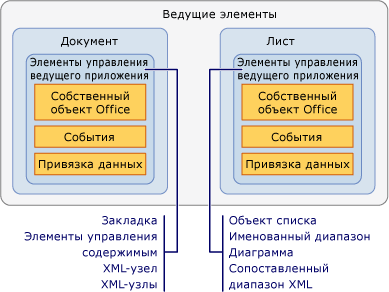

# Общие сведения о ведущих элементах и элементах управления ведущего приложения
  Ведущие элементы и элементы управления ведущего приложения — это типы элементов, помогающие предоставить модель программирования для решений Office, созданных с помощью средств разработки Office в Visual Studio. Ведущие элементы и элементы управления осуществляют взаимодействие с объектными моделями Microsoft Office Word и Microsoft Office Excel, основанными на модели COM, больше похожее на взаимодействие с управляемыми объектами, такими как элементы управления Windows Forms.

 [!INCLUDE[appliesto_controls](../vsto/includes/appliesto-controls-md.md)]

## Ведущие элементы
 Ведущие элементы являются типами в верхней части иерархии объектной модели в проектах Office. Среда выполнения [!INCLUDE[vsto_runtime](../vsto/includes/vsto-runtime-md.md)] определяет следующие ведущие элементы для решений Word и Excel.

- <xref:Microsoft.Office.Tools.Word.Document>

- <xref:Microsoft.Office.Tools.Excel.Workbook>

- <xref:Microsoft.Office.Tools.Excel.Worksheet>

- <xref:Microsoft.Office.Tools.Excel.ChartSheet>

  Каждый из этих типов расширяет объект, встроенный в объектной модели Word или Excel объектной модели, который называется *собственным объектом Office*. Например, ведущий элемент <xref:Microsoft.Office.Tools.Word.Document> расширяет объект <xref:Microsoft.Office.Interop.Word.Document> , который определен в основной сборке взаимодействия для Word.

  Ведущие элементы обычно имеют ту же базовую функциональность, что и соответствующие объекты Office, но улучшены путем добавления следующих возможностей.

- Возможность размещения управляемых элементов управления, включая элементы управления ведущего приложения и элементы управления Windows Forms.

- Расширенные модели событий. Некоторые события документа, книги и листа в собственных объектных моделях Word и Excel вызываются только на уровне приложения. Ведущие элементы предоставляют такие события на уровне документа; это упрощает обработку событий для конкретного документа.

### Общие сведения о ведущих элементах в проектах уровня документа
 В проектах уровня документа ведущие элементы предоставляют точку входа для вашего кода и имеют конструкторы, помогающие разрабатывать решения.

 Ведущие элементы <xref:Microsoft.Office.Tools.Word.Document> и <xref:Microsoft.Office.Tools.Excel.Worksheet> имеют связанные конструкторы, являющиеся визуальным представлением документа или листа, как конструктор Windows Forms. Этот конструктор можно использовать для изменения содержимого документа или листа непосредственно в Word или Excel и для перетаскивания элементов управления в рабочую область конструирования. Дополнительные сведения см. в разделе [документ ведущего элемента](../vsto/document-host-item.md) и [ведущего элемента листа](../vsto/worksheet-host-item.md).

 Ведущий элемент <xref:Microsoft.Office.Tools.Excel.Workbook> не действует как контейнер для элементов управления, имеющихся в пользовательском интерфейсе. Вместо этого конструктор для данного ведущего элемента функционирует как область компонентов, что позволяет перетаскивать компоненты, такие как <xref:System.Data.DataSet>, в рабочую область конструирования. Дополнительные сведения см. в разделе [ведущий элемент книги](../vsto/workbook-host-item.md).

 Ведущие элементы нельзя создавать программными средствами в проектах уровня документа. Вместо этого используйте классы `ThisDocument`, `ThisWorkbook`или `Sheet`*n* , которые Visual Studio автоматически создает в проекте во время разработки. Эти созданные классы являются производными от ведущих элементов и обеспечивают точку входа для кода. Дополнительные сведения см. в разделе [программные ограничения ведущих элементов и элементов управления ведущего приложения](../vsto/programmatic-limitations-of-host-items-and-host-controls.md).

### Общие сведения о ведущих элементах в проектах надстроек VSTO
 При создании надстройки VSTO у вас по умолчанию нет доступа к каким-либо ведущим элементам. Тем не менее вы можете создать ведущие элементы <xref:Microsoft.Office.Tools.Word.Document>, <xref:Microsoft.Office.Tools.Excel.Workbook>и <xref:Microsoft.Office.Tools.Excel.Worksheet> в надстройках VSTO Word и Excel в среде выполнения.

 После создания ведущего элемента вы можете выполнять такие задачи, как добавление элементов управления в документы. Дополнительные сведения см. [в разделе Расширение документов Word и книг Excel в надстройках VSTO во время выполнения](../vsto/extending-word-documents-and-excel-workbooks-in-vsto-add-ins-at-run-time.md).

## Элементы управления ведущего приложения
 Элементы управления ведущего приложения расширяют различные объекты пользовательского интерфейса в объектных моделях Word и Excel, таких как объекты `Microsoft.Office.Interop.Word.ContentControl` и <xref:Microsoft.Office.Interop.Excel.Range>.

 Для проектов Excel доступны следующие элементы управления ведущего приложения.

- [Элемент управления диаграммы](../vsto/chart-control.md)

- [Элемент управления ListObject](../vsto/listobject-control.md)

- [Элемент управления NamedRange](../vsto/namedrange-control.md)

- [Элемент управления XmlMappedRange](../vsto/xmlmappedrange-control.md)

  Для проектов Word доступны следующие элементы управления ведущего приложения.

- [Элемент управления Bookmark](../vsto/bookmark-control.md)

- [Элементы управления содержимым](../vsto/content-controls.md)

- [Элемент управления XMLNode](../vsto/xmlnode-control.md)

- [Элемент управления XMLNodes](../vsto/xmlnodes-control.md)

  Элементы управления ведущего приложения, добавленные в документы Office, ведут себя как встроенные объекты Office; однако элементы управления ведущего приложения имеют дополнительные функциональные возможности, включая события и возможности привязки данных. Например, если требуется записать события встроенного объекта <xref:Microsoft.Office.Interop.Excel.Range> в Excel, вы должны сначала обработать событие изменения листа. Затем необходимо определить, произошло ли изменение в <xref:Microsoft.Office.Interop.Excel.Range>. В отличие от этого, элемент управления ведущего приложения <xref:Microsoft.Office.Tools.Excel.NamedRange> имеет событие <xref:Microsoft.Office.Tools.Excel.NamedRange.Change> , которое может обрабатываться непосредственно.

  Связь между ведущим элементом и элементами управления ведущего приложения аналогична связи между элементами управления Windows Form и Windows Forms. Элемент управления <xref:Microsoft.Office.Tools.Excel.NamedRange> помещается в ведущий элемент <xref:Microsoft.Office.Tools.Excel.Worksheet> так же, как элемент управления "текстовое поле" помещается в форму Windows Forms. На следующем рисунке показана связь между ведущими элементами и элементами управления ведущего приложения.

  

  Вы также можете использовать в решениях Office элементы управления Windows Forms, добавляя их непосредственно в область документа Word и Excel. Дополнительные сведения см. [в разделе Windows Forms элементы управления в документах Office](../vsto/windows-forms-controls-on-office-documents-overview.md).

> [!NOTE]
> Добавление элементов управления ведущего приложения или элементов управления Windows Forms во вложенный документ Word не поддерживается.

### Добавление элементов управления ведущего приложения в документы
 В проектах уровня документа элементы управления ведущего приложения можно добавлять в документы Word или листы Excel во время разработки следующими способами.

- Добавляйте элементы управления ведущего приложения в документ во время разработки так же, как добавляется встроенный объект.

- Перетаскивайте элементы управления ведущего приложения из **панели элементов** в свои документы и листы. Элементы управления ведущего приложения доступны на вкладке **Элементы управления Excel** в проектах Excel, а элементы управления ведущего приложения Word доступны на вкладке **Элементы управления Word** в проектах Word.

- Перетаскивайте элементы управления ведущего приложения из окна **Источники данных** в свои документы и листы. Это позволяет добавлять элементы управления, которые уже привязаны к данным. Дополнительные сведения см. [в разделе Привязка данных к элементам управления в решениях Office](../vsto/binding-data-to-controls-in-office-solutions.md).

  В проектах надстроек VSTO уровня документа можно также добавлять некоторые элементы управления ведущего приложения в документы во время выполнения. Дополнительные сведения см. [в разделе Добавление элементов управления в документы Office во время выполнения](../vsto/adding-controls-to-office-documents-at-run-time.md).

  Дополнительные сведения о добавлении элементов управления ведущего приложения в документы см. в следующих разделах.

- [Как добавлять элементы управления "Диаграмма" на листы](../vsto/how-to-add-chart-controls-to-worksheets.md)

- [Как добавить элементы управления ListObject на листы](../vsto/how-to-add-listobject-controls-to-worksheets.md)

- [Как добавить элементы управления NamedRange в листы](../vsto/how-to-add-namedrange-controls-to-worksheets.md)

- [Как добавить элементы управления XMLMappedRange на листы](../vsto/how-to-add-xmlmappedrange-controls-to-worksheets.md)

- [Руководство. Добавление элементов управления Bookmark в документы Word](../vsto/how-to-add-bookmark-controls-to-word-documents.md)

- [Как добавить элементы управления содержимым в документы Word](../vsto/how-to-add-content-controls-to-word-documents.md)

- [Как добавить элементы управления XMLNode в документы Word](../vsto/how-to-add-xmlnode-controls-to-word-documents.md)

- [Как добавить элементы управления XMLNodes в документы Word](../vsto/how-to-add-xmlnodes-controls-to-word-documents.md)

### Имя элементы управления ведущего приложения
 При перетаскивании элемента управления ведущего приложения из **панели элементов** в документ этому элементу управления автоматически присваивается имя в виде типа элемента управления с последовательным номером. Например, закладки именуются как **bookmark1**, **bookmark2** и т. д. При добавлении элемента управления с помощью встроенной функциональности Word или Excel вы можете назначить ему определенное имя во время его создания. Вы также можете переименовывать свои элементы управления, изменяя значение свойства **Имя** в окне **Свойства** .

> [!NOTE]
> Для именования элементов управления ведущего приложения нельзя использовать зарезервированные слова. Например, если вы добавите в лист элемент управления <xref:Microsoft.Office.Tools.Excel.NamedRange> и измените его имя на **System**, при сборке проекта возникнут ошибки.

### Удаление элементов управления ведущего приложения
 В проектах уровня документа элементы управления ведущего приложения можно удалить во время разработки, выбрав элемент управления на листе Excel или в документе Word и нажав клавишу **Delete** . Однако для удаления элементов управления **вы должны использовать диалоговое окно** Присвоение имени <xref:Microsoft.Office.Tools.Excel.NamedRange> в Excel.

 Если элемент управления ведущего приложения добавлен в документ во время разработки, не следует удалять его программными средствами во время выполнения, поскольку при следующей попытке использовать этот элемент управления в коде возникнет исключение. Метод `Delete` элемента управления ведущего приложения удаляет только элементы управления ведущего приложения, добавленные в документ во время выполнения. Если вы вызовете метод `Delete` элемента управления ведущего приложения, созданного во время разработки, возникнет исключение.

 Например, метод <xref:Microsoft.Office.Tools.Excel.NamedRange.Delete%2A> элемента управления <xref:Microsoft.Office.Tools.Excel.NamedRange> успешно удаляет <xref:Microsoft.Office.Tools.Excel.NamedRange> , только если он был добавлен в лист программным образом, который называется динамическим созданием элементов управления ведущего приложения. Динамически созданные элементы управления ведущего приложения можно также удалить, передав имя элемента управления в метод `Remove` свойства <xref:Microsoft.Office.Tools.Excel.Worksheet.Controls%2A> или <xref:Microsoft.Office.Tools.Word.Document.Controls%2A> . Дополнительные сведения см. [в разделе Добавление элементов управления в документы Office во время выполнения](../vsto/adding-controls-to-office-documents-at-run-time.md).

 Если конечный пользователь удаляет элемент управления ведущего приложения из документа во время выполнения, может произойти непредвиденный сбой решения. Для защиты от удаления элементов управления ведущего приложения можно использовать функции защиты документа в Word и Excel. Дополнительные сведения см. в разделе [примеры и пошаговые руководства по разработке приложений для Office](../vsto/office-development-samples-and-walkthroughs.md).

> [!NOTE]
> Не удаляйте программным образом элементы управления во время работы обработчика событий `Shutdown` документа или листа. Если возникает событие `Shutdown` , элементы пользовательского интерфейса становятся недоступными. Если вы хотите удалить элементы управления до закрытия приложения, добавьте свой код в другой обработчик событий, например в `BeforeClose` или `BeforeSave`.

### Программирование для событий элемента управления ведущего приложения
 Один из способов, которым элементы управления ведущего приложения расширяют объекты Office, является добавление событий. Например, объект <xref:Microsoft.Office.Interop.Excel.Range> в Excel и объект <xref:Microsoft.Office.Interop.Word.Bookmark> в Word не имеют событий, но [!INCLUDE[vsto_runtime](../vsto/includes/vsto-runtime-md.md)] расширяет эти объекты, добавляя программируемые события. Вы можете получать доступ к этим событиям и программировать реакцию на них так же, как это делается с событиями элементов управления в Windows Forms: через раскрывающийся список событий в Visual Basic и страницу свойств событий в C#. Дополнительные сведения см. в разделе [Пошаговое руководство. Программирование для событий элемента управления NamedRange](../vsto/walkthrough-programming-against-events-of-a-namedrange-control.md).

> [!NOTE]
> Не устанавливайте для свойства <xref:Microsoft.Office.Interop.Excel._Application.EnableEvents%2A> объекта <xref:Microsoft.Office.Interop.Excel.Application> в Excel значение **false**. Установка этого свойства в **значение false** предотвращает вызов приложением Excel каких бы то ни было событий, включая события элементов управления ведущего приложения.

## См. также раздел
- [Программные ограничения ведущих элементов и элементов управления ведущего приложения](../vsto/programmatic-limitations-of-host-items-and-host-controls.md)
- [Программирование надстроек VSTO](../vsto/programming-vsto-add-ins.md)
- [Программы настройки на уровне документа](../vsto/programming-document-level-customizations.md)
- [Автоматизация Word с помощью расширенных объектов](../vsto/automating-word-by-using-extended-objects.md)
- [Автоматизация Excel с помощью расширенных объектов](../vsto/automating-excel-by-using-extended-objects.md)
- [Элементы управления в документах Office](../vsto/controls-on-office-documents.md)
- [Привязка данных к элементам управления в решениях Office](../vsto/binding-data-to-controls-in-office-solutions.md)
