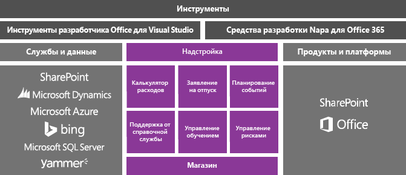
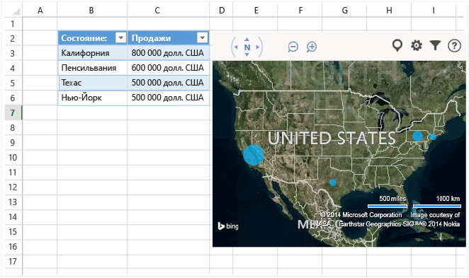
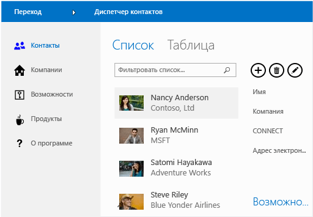

# Разработка приложений для Office и SharePoint в Visual Studio
  Вы можете расширить возможности Microsoft Office и SharePoint, создав облегченное приложение или надстройку, которые пользователи загружают из [Магазина Office](https://store.office.com/) или каталога организации, либо создав решение на основе .NET Framework, которое пользователи устанавливают на компьютерах.

 В этом разделе.

- [Создание надстроек для Office и SharePoint](#Apps)

- [Создание надстройки VSTO](#Add-ins)

- [Создание решения SharePoint](#Solutions)

##  Создание надстроек для Office и SharePoint
 В Office 2013 и SharePoint 2013 появилась новая модель надстроек, которая помогает создавать, распространять и продавать надстройки, расширяющие возможности Office и SharePoint.  Эти надстройки могут выполняться в Office или SharePoint Online, и пользователи могут работать с ними на разных устройствах.

 Узнайте, как использовать новую [модель надстроек Office](/office/dev/add-ins/overview/office-add-ins) для расширения возможностей Office для пользователей.

 Эти надстройки имеют небольшие объемы по сравнению с надстройками и решениями VSTO, и их можно создавать с помощью практически любой технологии веб-программирования, такой как HTML5, JavaScript, CSS3 и XML.  Чтобы приступить к работе, используйте Office Developer Tools в Visual Studio, который позволяет создавать проекты, писать код и запускать надстройки в браузере.

 

### Создание надстройки Office
 Чтобы расширить функциональные возможности Office, создайте надстройку Office. По сути, это веб-страница, размещенная в приложении Office, например Excel, Word, Outlook и PowerPoint. Ваше приложение может расширять функциональные возможности документов, таблиц, сообщений электронной почты, встреч, презентаций или проектов.

 Вы можете продавать приложение в Магазине Office.  [Магазин Office](https://store.office.com/) упрощает получение прибыли от надстроек, управление обновлениями и отслеживание телеметрических данных. Приложение также можно опубликовать для пользователей посредством каталога приложений в SharePoint или на сервере Exchange Server.

 Следующее приложение для Office показывает данные листа на карте Bing.

 

 **Дополнительные сведения**

|Кому|См.|
|--------|---------|
|Узнайте больше о надстройках Office, а затем создайте собственную надстройку.|[Надстройки Office](/office/dev/add-ins/publish/publish)|
|Сравните различные способы расширения возможностей Office и решите, следует ли использовать приложение или надстройку Office.|[План для надстроек Office, VSTO и VBA](/archive/blogs/officeapps/roadmap-for-apps-for-office-vsto-and-vba)|

### Создание надстройки SharePoint
 Чтобы расширить возможности SharePoint для пользователей, создайте надстройку SharePoint. Это, по сути, небольшое, простое в использовании автономное приложение, которое решает необходимость пользователей или бизнеса.

 Вы можете продавать приложение для SharePoint через [Магазин Office](https://store.office.com/). Надстройку также можно опубликовать для пользователей через каталог надстроек в SharePoint.  Владельцы сайтов могут устанавливать, обновлять и удалять вашу надстройку на своих сайтах SharePoint, не прибегая к помощи администратора фермы серверов или семейства веб-сайтов.

 Ниже приведен пример приложения для SharePoint, помогающего пользователям управлять бизнес-контактами.

 

 **Дополнительные сведения**

|Кому|См.|
|--------|---------|
|Узнайте больше о надстройках SharePoint, а затем создайте собственную надстройку.|[Надстройки SharePoint](/sharepoint/dev/sp-add-ins/sharepoint-add-ins)|
|Сравните надстройки SharePoint с традиционными решениями SharePoint.|[Надстройки SharePoint по сравнению с решениями SharePoint](/sharepoint/dev/general-development/sharepoint-server-application-lifecycle-management)|
|Решите, следует ли создать надстройку SharePoint или решение SharePoint.|[Выбор между надстройками SharePoint и решениями SharePoint](/sharepoint/dev/general-development/sharepoint-server-application-lifecycle-management)|

##  Создание надстройки VSTO
 Создайте надстройку VSTO для Office 2007 или Office 2010 или расширьте Office 2013 и Office 2016, чем это возможно в надстройках Office. Надстройки VSTO запускаются только на рабочем столе. Пользователям необходимо устанавливать надстройки VSTO, поэтому они, как правило, сложнее в развертывании и поддержке.  Однако надстройку VSTO можно теснее интегрировать с Office. Например, она может добавлять вкладки и элементы управления на ленту Office и выполнять расширенные задачи автоматизации, такие как слияние документов или изменение диаграмм. Вы можете использовать платформу .NET Framework и языки программирования C# и Visual Basic для взаимодействия с объектами Office.

 Ниже приведен пример того, что может сделать Надстройка VSTO. Эта надстройка VSTO добавляет элементы управления ленты, настраиваемую область задач и диалоговое окно в PowerPoint.

 

 **Дополнительные сведения**

|Кому|Чтение|
|--------|----------|
|Сравните различные способы расширения возможностей Office и решите, следует ли использовать надстройку VSTO или надстройку Office.|[План для надстроек Office, VSTO и VBA](/archive/blogs/officeapps/roadmap-for-apps-for-office-vsto-and-vba)|
|Создание надстройки VSTO.|[Создание настройки VSTO с помощью Visual Studio](create-vsto-add-ins-for-office-by-using-visual-studio.md)|

##  Создание решения SharePoint
 Создание решения SharePoint для SharePoint Foundation 2010 и SharePoint Server 2010 или расширение SharePoint 2013 и SharePoint 2016 способами, помимо возможностей надстройки SharePoint.

 Для решений SharePoint требуется локальная ферма серверов SharePoint. Администраторы должны устанавливать их, а так как решения выполняются в SharePoint, они могут повлиять на производительность сервера. Однако решения обеспечивают более широкий доступ к объектам SharePoint. Кроме того, при создании решения SharePoint вы можете использовать платформу .NET Framework и языки программирования C# и Visual Basic для взаимодействия с объектами SharePoint.

 **Дополнительные сведения**

|Кому|См.|
|--------|---------|
|Сравните решения SharePoint с надстройками SharePoint.|[Надстройки SharePoint по сравнению с решениями SharePoint](/sharepoint/dev/general-development/sharepoint-server-application-lifecycle-management)|
|Создайте решение SharePoint.|[Создание решений SharePoint](../sharepoint/create-sharepoint-solutions.md)|