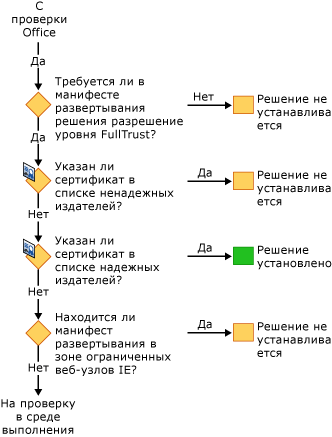
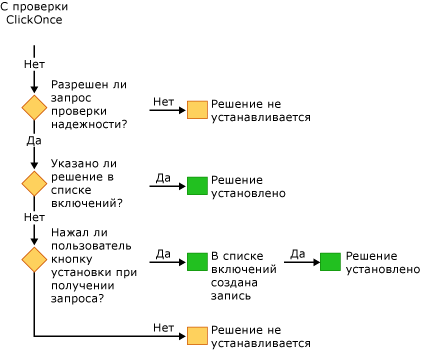

# Безопасные решения Office
  Модель безопасности для решений Office включает в себя несколько технологий: [!INCLUDE[vsto_runtime](../vsto/includes/vsto-runtime-md.md)] , [!INCLUDE[ndptecclick](../vsto/includes/ndptecclick-md.md)] , центр управления безопасностью в Microsoft Office и зону ограниченных узлов Internet Explorer. Работа различных возможностей безопасности описана в следующих разделах.

- [Предоставление доверия решениям Office](#GrantingTrustToSolutions)

- [Предоставление доверия документам](#GrantingTrustToDocuments)

- [Предоставление доверия при использовании установщик Windows](#GrantingTrustWindowsInstaller)

- [Конкретные вопросы безопасности для решений Office](#Security)

- [Безопасность во время разработки](#SecurityDuringDeployment)

- [Набор средств Visual Studio для Office (cреда выполнения)](#VisualStudioToolsForOfficeRuntime)

  [!INCLUDE[appliesto_all](../vsto/includes/appliesto-all-md.md)]

##  Предоставление доверия решениям Office
 Присвоение уровня доверия решениям Office означает изменение политики безопасности для каждого конечного пользователя таким образом, что доверие решению Office предоставляется на основании следующего свидетельства.

- Сертификат, используемый для подписания манифеста развертывания.

- URL-адрес манифеста развертывания.

  Дополнительные сведения см. [в статье предоставление доверия для решений Office](../vsto/granting-trust-to-office-solutions.md).

##  Предоставление доверия документам
 Настройка уровня документа требует, чтобы документ находился в каталоге, назначенном в качестве надежного расположения. Дополнительные сведения см. в разделе [Предоставление доверия документам](../vsto/granting-trust-to-documents.md).

##  Предоставление доверия при использовании установщик Windows
 Чтобы создать MSI-файл для установки решений Office в каталог Program Files, можно использовать установщик Windows. Для этого требуются права администратора. Для решений Office в каталоге Program Files среда выполнения Visual Studio 2010 Tools for Office считает эти решения Office доверенными и не отображает запрос о доверии ClickOnce.

##  Конкретные вопросы безопасности для решений Office
 Средства безопасности, предоставляемые [!INCLUDE[net_v40_short](../sharepoint/includes/net-v40-short-md.md)], [!INCLUDE[net_v45](../vsto/includes/net-v45-md.md)] и Microsoft Office, помогают защитить решения Office от различных угроз безопасности. Дополнительные сведения см. в статье [вопросы безопасности для решений Office](../vsto/specific-security-considerations-for-office-solutions.md).

##  Безопасность во время разработки
 Чтобы упростить процесс разработки, Visual Studio задает политику безопасности, требуемую для выполнения и отладки решения на компьютере, при каждой сборке проекта. В некоторых случаях могут потребоваться дополнительные меры обеспечения безопасности при разработке проекта.

### Решения на уровне документа
 При разработке следующих типов проектов необходимо добавить полный путь к документу в список надежных расположений в приложении Microsoft Office.

- Решения уровня документа, наявляющиеся в общей сетевой папке, например *\\ \servername\sharename*.

- Решения на уровне документа для Word, которые используют файлы *. doc* или *. docm* .

  При добавлении местоположения документа в список надежных расположений включите подкаталоги или конкретно укажите папки для отладки и сборки. Дополнительные сведения см. в статье Microsoft Office Справка в Интернете [Создание, удаление или изменение надежного расположения файлов](https://support.office.com/article/Create-remove-or-change-a-trusted-location-for-your-files-f5151879-25ea-4998-80a5-4208b3540a62).

### Временные сертификаты
 Если сертификат для подписи еще не существует, Visual Studio создает временный сертификат. Этот временный сертификат следует использовать только во время разработки, а для развертывания необходимо приобрести официальный сертификат.

 Временный сертификат создается после первой сборки проекта Office. При следующем нажатии клавиши **F5** проект будет перестроен, так как проект будет помечен как измененный при добавлении сертификата.

 Через некоторое время может накопиться большое количество временных сертификатов, поэтому их нужно периодически удалять.

##  Инструменты Visual Studio для среды выполнения Office
 [!INCLUDE[vsto_runtime](../vsto/includes/vsto-runtime-md.md)]Компонент содержит функции для проверки удостоверения издателя и разрешений, предоставленных настройке. Он проверяет разрешения, выполняя последовательность проверок безопасности.

### Безопасность во время загрузки настройки
 При загрузке настройки на уровне документа [!INCLUDE[vsto_runtime](../vsto/includes/vsto-runtime-md.md)] всегда проверяет, находится ли документ в списке надежных расположений. Кроме того, среда выполнения проверяет, запрашивает ли решение разрешения FullTrust в манифесте приложения. Во время загрузки настройки он не выполняет дополнительные проверки безопасности.

### Последовательность проверок безопасности во время установки
 При установке или обновлении решения Office [!INCLUDE[vsto_runtime](../vsto/includes/vsto-runtime-md.md)] выполняет ряд проверок безопасности в определенной последовательности для принятия решения о доверии. Решение устанавливается или обновляется только в том случае, если среда выполнения определяет, что это решение является доверенным.

 Процесс установки можно запустить одним из четырех способов: запустив программу установки, открыв манифест развертывания, открыв узел приложения Microsoft Office или выполнив *VSTOInstaller.exe*.

 Первая проверка безопасности применяется только к решениям уровня документа. Документ, принадлежащий решению уровня документа, должен находиться в надежном расположении. Если документ находится в удаленной сетевой общей папке или имеет расширение *doc* или *DOCM* , расположение документа необходимо добавить в список надежных расположений. Дополнительные сведения см. в разделе [Предоставление доверия документам](../vsto/granting-trust-to-documents.md).

 

 Следующий набор проверок безопасности выполняется [!INCLUDE[vsto_runtime](../vsto/includes/vsto-runtime-md.md)] и ClickOnce. Чтобы пройти эти проверки, решения Office должны запрашивать разрешения FullTrust, должны быть подписаны сертификатом, отсутствующим в списке издателей, к которым нет доверия, и должны находиться в расположении, не входящем в зону ограниченных узлов браузера Internet Explorer. Если сертификат находится в списке надежных издателей, решение устанавливается немедленно. В противном случае, если решение проходит все проверки, оно передается на последний этап проверок.

 

 Если [!INCLUDE[ndptecclick](../vsto/includes/ndptecclick-md.md)] запрос о доверии разрешен и решению еще не было предоставлено доверие, среда выполнения разрешит пользователю принять решение о доверии для конечного пользователя. Если пользователь предоставляет решению доверие, в пользовательский список включения добавляется запись. Все решения в пользовательском списке включения имеют полное доверие и могут быть установлены и запущены.

 Начиная с версии Visual Studio 2010, список включения игнорируется в том случае, если решение Office установлено с помощью установщика Windows (MSI) в каталог Program Files. Дополнительные сведения см. в разделе [доверие решений Office с помощью списков включения](../vsto/trusting-office-solutions-by-using-inclusion-lists.md).

 

## См. также раздел

- [Предоставление доверия решениям Office](../vsto/granting-trust-to-office-solutions.md)
- [Предоставление доверия документам](../vsto/granting-trust-to-documents.md)
- [Доверять решениям Office с помощью списков включения](../vsto/trusting-office-solutions-by-using-inclusion-lists.md)
- [Как настроить безопасность списка включений](../vsto/how-to-configure-inclusion-list-security.md)
- [Практические руководства. Подписывание решений Office](../vsto/how-to-sign-office-solutions.md)
- [Устранение неполадок в системе безопасности решений Office](../vsto/troubleshooting-office-solution-security.md)
- [Манифесты приложений для решений Office](../vsto/application-manifests-for-office-solutions.md)
- [Манифесты развертывания для решений Office](../vsto/deployment-manifests-for-office-solutions.md)
- [Справочные сведения ClickOnce](../deployment/clickonce-reference.md)
- [Развертывание решения Office](../vsto/deploying-an-office-solution.md)
