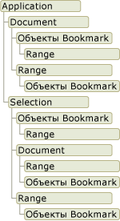

# Общие сведения об объектной модели Word
  При разработке решений Word в Visual Studio выполняется взаимодействие с объектной моделью Word. Эта объектная модель состоит из классов и интерфейсов, которые предоставляются в основной сборке взаимодействия для Word и определены в пространстве имен <xref:Microsoft.Office.Interop.Word>.  
  
 [!INCLUDE[appliesto_wdalldocapp](../vsto/includes/appliesto-wdalldocapp-md.md)]  
  
 В этом разделе приводится краткий обзор объектной модели Word. Список ресурсов для более глубокого изучения объектной модели Word см. в разделе [Работа с документацией по объектной модели Word](#WordOMDocumentation).  
  
 Дополнительные сведения об использовании объектной модели Word для выполнения конкретных задач см. в следующих разделах.  
  
-   [Работа с документами](../vsto/working-with-documents.md)  
  
-   [Работа с текстом в документах](../vsto/working-with-text-in-documents.md)  
  
-   [Работа с таблицами](../vsto/working-with-tables.md)  
  
##   Основные сведения об объектной модели Word  
 Word предоставляет сотни различных объектов, с которыми можно взаимодействовать. Эти объекты организованы в виде иерархии, которая точно соответствует пользовательскому интерфейсу. В верхней части иерархии находится объект <xref:Microsoft.Office.Interop.Word.Application>. Этот объект представляет текущий экземпляр Word. Объект <xref:Microsoft.Office.Interop.Word.Application> содержит объекты <xref:Microsoft.Office.Interop.Word.Document>, <xref:Microsoft.Office.Interop.Word.Selection>, <xref:Microsoft.Office.Interop.Word.Bookmark> и <xref:Microsoft.Office.Interop.Word.Range>. Каждый из этих объектов содержит множество методов и свойств, к которым можно обращаться для работы с объектом и взаимодействия с ним.  
  
 На следующем рисунке показано одно представление этих объектов в иерархии объектной модели Word.  
  
   
  
 На первый взгляд объекты перекрываются друг с другом. Например, объекты <xref:Microsoft.Office.Interop.Word.Document> и <xref:Microsoft.Office.Interop.Word.Selection> являются элементами объекта <xref:Microsoft.Office.Interop.Word.Application>, но объект <xref:Microsoft.Office.Interop.Word.Document> также является элементом объекта <xref:Microsoft.Office.Interop.Word.Selection>. Объекты <xref:Microsoft.Office.Interop.Word.Document> и <xref:Microsoft.Office.Interop.Word.Selection> содержат объекты <xref:Microsoft.Office.Interop.Word.Bookmark> и <xref:Microsoft.Office.Interop.Word.Range>. Перекрытие существует, так как для доступа к объекту одного и того же типа можно использовать различные способы. Например, вы применяете форматирование к объекту <xref:Microsoft.Office.Interop.Word.Range>, но может потребоваться доступ к диапазону текущего выделения, конкретного абзаца, раздела или всего документа.  
  
 В следующих разделах кратко описаны объекты верхнего уровня и их взаимодействие друг с другом. К таким объектам относятся пять следующих объектов.  
  
-   Объект Application  
  
-   Объект Document  
  
-   Объект Selection  
  
-   Range \- объект  
  
-   Объект Bookmark  
  
 Помимо объектной модели Word, проекты Office в Visual Studio предоставляют *ведущие элементы* и *элементы управления ведущего приложения*, расширяющие некоторые объекты из объектной модели Word. Поведение ведущих элементов и элементов управления ведущего приложения аналогично поведению объектов Word, однако они обладают дополнительными функциональными возможностями, такими как возможность привязки данных и дополнительные события. Дополнительные сведения см. в разделах [Автоматизация Word с помощью расширенных объектов](../vsto/automating-word-by-using-extended-objects.md) и [Общие сведения о ведущих элементах и элементах управления ведущего приложения](../vsto/host-items-and-host-controls-overview.md).  
  
### Объект приложения  
 Объект <xref:Microsoft.Office.Interop.Word.Application> представляет приложение Word и является родителем для всех других объектов. Обычно его элементы применяются к Word как к единому целому. Свойства и методы данного объекта можно использовать для управления средой Word.  
  
 В проектах надстройки VSTO для получения доступа к объекту <xref:Microsoft.Office.Interop.Word.Application> можно использовать поле `Application` класса `ThisAddIn`. Для получения дополнительной информации см. [Приступая к программированию надстроек VSTO](../vsto/programming-vsto-add-ins.md).  
  
 В проектах на уровне документа для получения доступа к объекту <xref:Microsoft.Office.Interop.Word.Application> можно использовать свойство <xref:Microsoft.Office.Tools.Word.Document.Application%2A> класса `ThisDocument`.  
  
### Объект Document  
 <xref:Microsoft.Office.Interop.Word.Document> – это центральный объект для программирования в Word. Он представляет документ и все его содержимое. При открытии существующего документа или создании нового документа вы создаете новый объект <xref:Microsoft.Office.Interop.Word.Document>, который добавляется в коллекцию <xref:Microsoft.Office.Interop.Word.Documents> объекта <xref:Microsoft.Office.Interop.Word.Application>. Документ, который находится в фокусе, называется активным документом. Он представлен свойством <xref:Microsoft.Office.Interop.Word._Application.ActiveDocument%2A> объекта <xref:Microsoft.Office.Interop.Word.Application>.  
  
 Средства разработки Office в Visual Studio расширяют объект <xref:Microsoft.Office.Interop.Word.Document>, предоставляя тип <xref:Microsoft.Office.Tools.Word.Document>. Этот тип является *ведущим элементом*, который предоставляет доступ ко всем функциям объекта <xref:Microsoft.Office.Interop.Word.Document> и добавляет дополнительные события, а также позволяет добавлять управляемые элементы управления.  
  
 При создании проекта на уровне документа для доступа к элементам <xref:Microsoft.Office.Tools.Word.Document> можно использовать созданный класс `ThisDocument` в проекте. Для доступа к членам ведущего элемента <xref:Microsoft.Office.Tools.Word.Document> можно использовать ключевые слова **Me** или **this** из кода в классе `ThisDocument` или `Globals.ThisDocument` из кода за пределами класса `ThisDocument`. Для получения дополнительной информации см. [Настройки программирования уровня документа](../vsto/programming-document-level-customizations.md). Например, для выделения первого абзаца в документе используйте следующий код.  
  
 [!code-csharp[Trin_VstcoreWordAutomation#120](../snippets/csharp/VS_Snippets_OfficeSP/Trin_VstcoreWordAutomation/CS/ThisDocument.cs#120)]
 [!code-vb[Trin_VstcoreWordAutomation#120](../snippets/visualbasic/VS_Snippets_OfficeSP/Trin_VstcoreWordAutomation/VB/ThisDocument.vb#120)]  
  
 В проектах надстройки VSTO во время выполнения можно создавать ведущие элементы <xref:Microsoft.Office.Tools.Word.Document>. Созданный ведущий элемент можно использовать для добавления элементов управления в связанный документ. Для получения дополнительной информации см. [Расширение документов Word и книг Excel в надстройках VSTO в среде выполнения](../vsto/extending-word-documents-and-excel-workbooks-in-vsto-add-ins-at-run-time.md).  
  
### Объект Selection  
 Объект <xref:Microsoft.Office.Interop.Word.Selection> представляет текущую выбранную область. При выполнении операции в пользовательском интерфейсе Word, например при выделении текста полужирным шрифтом, вы выбираете или выделяете текст, а затем применяете форматирование. Объект <xref:Microsoft.Office.Interop.Word.Selection> всегда присутствует в документе. Если ничего не выбрано, данный объект представляет точку вставки. Кроме того, выделение может охватывать несколько блоков текста, которые не являются смежными.  
  
### Объект Range  
 Объект <xref:Microsoft.Office.Interop.Word.Range> представляет непрерывную область в документе и определяется позициями начального и конечного символов. Объект <xref:Microsoft.Office.Interop.Word.Range> не обязательно должен быть единственным. В одном документе можно определить несколько объектов <xref:Microsoft.Office.Interop.Word.Range>. Объект <xref:Microsoft.Office.Interop.Word.Range> имеет следующие характеристики.  
  
-   Он может включать в себя одну точку вставки, диапазон текста или весь документ.  
  
-   Он содержит непечатаемые символы, например пробелы, символы табуляции и знаки абзаца.  
  
-   Он может быть областью, представляемой текущим выделением, или может представлять область, отличную от текущего выделения.  
  
-   Он не отображается в документе \(в отличие от выделения, которое отображается всегда\).  
  
-   Он не сохраняется вместе с документом и существует только во время выполнения кода.  
  
 При вставке текста в конец диапазона Word автоматически расширяет диапазон на объем вставленного текста.  
  
### Объекты элементов управления содержимым  
 <xref:Microsoft.Office.Interop.Word.ContentControl> позволяет управлять вводом и представлением как текста, так и содержимого других типов, в документах Word.<xref:Microsoft.Office.Interop.Word.ContentControl> может отображать несколько разных типов пользовательского интерфейса, которые оптимизированы для применения в документах Word, например элемент управления форматированным текстом, элемент выбора даты или поле со списком.<xref:Microsoft.Office.Interop.Word.ContentControl> также можно использовать, чтобы пользователи не могли редактировать разделы документа или шаблона.  
  
 Visual Studio расширяет объект <xref:Microsoft.Office.Interop.Word.ContentControl> до нескольких элементов управления ведущего приложения. В то время как объект <xref:Microsoft.Office.Interop.Word.ContentControl> может отображать пользовательский интерфейс любого из типов, доступных для элементов управления содержимым, для всех таких элементов Visual Studio предоставляет отдельный тип. Например, для создания элемента управления форматированным текстом можно использовать <xref:Microsoft.Office.Tools.Word.RichTextContentControl>, а для создания элемента выбора даты — <xref:Microsoft.Office.Tools.Word.DatePickerContentControl>. Поведение этих элементов управления ведущего приложения аналогично поведению собственного элемента <xref:Microsoft.Office.Interop.Word.ContentControl>, однако они имеют дополнительные события и возможности привязки данных. Для получения дополнительной информации см. [Элементы управления содержимым](../vsto/content-controls.md).  
  
### Объект Bookmark  
 Объект <xref:Microsoft.Office.Interop.Word.Bookmark> представляет непрерывную область в документе с позициями начального и конечного символов. Закладки можно использовать, чтобы пометить расположение в документе или в качестве контейнера для текста в документе. Объект <xref:Microsoft.Office.Interop.Word.Bookmark> может состоять из точки вставки или даже содержать целый документ. Объект <xref:Microsoft.Office.Interop.Word.Bookmark> имеет следующие характеристики, которые отличают его от объекта <xref:Microsoft.Office.Interop.Word.Range>.  
  
-   Во время разработки можно задать имя закладки.  
  
-   Объекты <xref:Microsoft.Office.Interop.Word.Bookmark> сохраняются вместе с документом. Следовательно, при остановке выполнения кода или закрытии документа они не удаляются.  
  
-   Закладки можно скрывать или делать видимыми, устанавливая значение **false** или **true** для свойства <xref:Microsoft.Office.Interop.Word.View.ShowBookmarks%2A> объекта <xref:Microsoft.Office.Interop.Word.View>.  
  
 Visual Studio расширяет объект <xref:Microsoft.Office.Interop.Word.Bookmark>, предоставляя элемент управления ведущего приложения <xref:Microsoft.Office.Tools.Word.Bookmark>. Поведение элемента управления ведущего приложения<xref:Microsoft.Office.Interop.Word.Bookmark> аналогично поведению собственного элемента <xref:Microsoft.Office.Tools.Word.Bookmark>, однако он имеет дополнительные события и возможности привязки данных. Для привязки данных к элементу управления закладками в документе можно использовать тот же способ, что и для привязки данных к элементу управления текстовым полем в форме Windows Forms. Для получения дополнительной информации см. [Элементы управления Bookmark](../vsto/bookmark-control.md).  
  
##   Работа с документацией по объектной модели Word  
 Полные сведения об объектной модели Word см. в справочнике по основной сборке взаимодействия \(PIA\) Word, а также в справочнике по объектной модели Visual Basic для приложений \(VBA\).  
  
### Справочник по основной сборке взаимодействия  
 В справочной документации по основной сборке взаимодействия Word описываются типы в основной сборке взаимодействия для Word. Эта документация доступна на следующей странице: [Справочник по основной сборке взаимодействия Word 2010](http://go.microsoft.com/fwlink/?LinkId=189588).  
  
 Дополнительные сведения о структуре основных сборок взаимодействия Word, включая различия между классами и интерфейсами в основных сборках взаимодействия и порядок реализации событий в этих сборках, см. в разделе [Общие сведения о классах и интерфейсах в основных сборках взаимодействия Office](http://go.microsoft.com/fwlink/?LinkId=189592).  
  
### Справочник по объектной модели VBA  
 В справочных документах по объектной модели VBA объектная модель Word описана в том виде, в котором она предоставляется коду VBA. Дополнительные сведения см. в разделе [Справочник по объектной модели Word 2010](http://go.microsoft.com/fwlink/?LinkId=199772).  
  
 Все объекты и элементы в справочнике по объектной модели VBA соответствуют типам и участникам основной сборки взаимодействия Word. Например, объект Document в справочнике по объектной модели VBA соответствует объекту <xref:Microsoft.Office.Interop.Word.Document> в основной сборке взаимодействия Word. Несмотря на то что в справочнике по объектной модели VBA содержатся примеры кода для большинства свойств, методов и событий, необходимо преобразовать код VBA в этом справочнике в код Visual Basic или Visual C\#, если требуется использовать их в проекте Word, создаваемом с помощью Visual Studio.  
  
## См. также  
 [Основные сборки взаимодействия Office](../vsto/office-primary-interop-assemblies.md)   
 [Автоматизация Word с помощью расширенных объектов](../vsto/automating-word-by-using-extended-objects.md)   
 [Работа с документами](../vsto/working-with-documents.md)   
 [Работа с текстом в документах](../vsto/working-with-text-in-documents.md)   
 [Работа с таблицами](../vsto/working-with-tables.md)   
 [Общие сведения о ведущих элементах и элементах управления ведущего приложения](../vsto/host-items-and-host-controls-overview.md)   
 [Программные ограничения ведущих элементов и элементов управления ведущего приложения](../vsto/programmatic-limitations-of-host-items-and-host-controls.md)   
 [Необязательные параметры в решениях Office](../vsto/optional-parameters-in-office-solutions.md)  
  
  