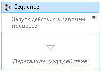

# Как добавлять комментарии в рабочий процесс в конструкторе рабочих процессов

Чтобы упростить создание больших и сложных рабочих процессов, платформа .NET Framework 4,5 позволяет разработчику добавлять заметки к следующим типам элементов в конструкторе:

- <xref:System.Activities.Activity>

- <xref:System.Activities.Statements.State>

- <xref:System.Activities.Statements.Transition>

- Классы, производные от <xref:System.Activities.Statements.FlowNode>.

- <xref:System.Activities.Variable>

- <xref:System.Activities.Argument>

> [!IMPORTANT]
> Содержимое заметки сохраняется в виде обычного текста в файле XAML, связанном с рабочим процессом, и потенциально может быть прочитано другими. Избегайте добавлять в заметку конфиденциальные сведения.

## Добавление заметки к действию в конструкторе

1. В конструкторе рабочих процессов щелкните правой кнопкой мыши элемент в конструкторе рабочих процессов и выберите **заметки**, **Добавить заметку**.

1. Добавьте текст заметки в предоставленное для этого место.

   Элемент отображает значок заметки. При наведении указателя мыши на значок заметки отображается текст заметки.

## Отображение заметки в конструкторе действия

1. В конструкторе действий с заметкой, отображаемой за пределами действия, щелкните значок **закрепления** в декоративном элементе заметки.

   Заметка отображается в конструкторе действия. На снимке экрана ниже заметка «Запуск действия в рабочем процессе» отображается в конструкторе действия.

   

2. Чтобы отобразить заметку за пределами конструктора действия, наведите указатель мыши на область заметки в конструкторе действия и щелкните значок **открепить** .

   

## Отображение или скрытие всех заметок

1. Щелкните правой кнопкой мыши действие, которое имеет заметку. Выберите **аннотации**, **Покажите все заметки**.

   Все заметки отображаются в конструкторах действий.

1. Чтобы отобразить все заметки вне конструкторов действия, щелкните действие правой кнопкой мыши и выберите **заметки**, **Скрыть все заметки**.

## Изменение или удаление заметки для действия

1. Щелкните правой кнопкой мыши действие, которое имеет заметку.

1. Выбор **заметок**, **изменение заметки** или **удаление заметки**.

   Заметка открыта для редактирования или удаления.

1. Чтобы удалить все заметки одновременно, щелкните правой кнопкой мыши конструктор рабочих процессов и выберите **Аннотация**, **удалите все заметки**.

## Добавление, изменение и удаление заметки для переменной или аргумента.

1. Щелкните правой кнопкой мыши переменную или аргумент, затем выберите «Добавить заметку».

1. Введите текст заметки. Переменная или аргумент отображает значок заметки.

1. Щелкните правой кнопкой мыши переменную или аргумент с заметкой. Выберите «Изменить заметку».

   Заметка открыта для редактирования.

1. Щелкните правой кнопкой мыши переменную или аргумент с заметкой. Выберите «Удалить заметку».

   Заметка удалена.
