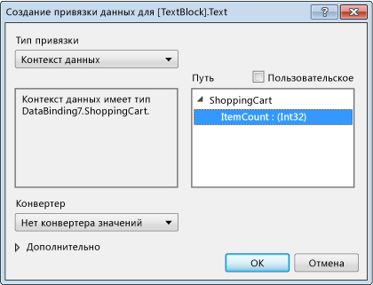

# <a name="walkthrough-bind-to-data-in-xaml-designer"></a>Пошаговое руководство. Привязка к данным в конструкторе XAML

В конструкторе XAML можно задать свойства привязки данных с помощью монтажной панели и окна свойств. В примере в этом пошаговом руководстве показано, как привязать данные к элементу управления. В частности, это пошаговое руководство показывает, как создать простой класс корзины для покупок, имеющий [DependencyProperty](xref:Windows.UI.Xaml.DependencyProperty) с именем `ItemCount`, а затем привязать свойство `ItemCount` к свойству **Text** элемента управления [TextBlock](xref:Windows.UI.Xaml.Controls.TextBlock).

## <a name="to-create-a-class-to-use-as-a-data-source"></a>Создание класса для использования в качестве источника данных

1. В меню **Файл** последовательно выберите пункты **Создать** > **Проект**.

1. В диалоговом окне **Новый проект** разверните узел **Visual C#** или **Visual Basic**, разверните узел **Классическое приложение Windows** и выберите шаблон **Приложение WPF**.

1. Укажите **BindingTest** в качестве имени проекта и нажмите кнопку **ОК**.

1. Откройте файл **MainWindow.XAML.CS** (или **MainWindow. XAML. vb**) и добавьте следующий код. В C# добавьте код в пространстве имен `BindingTest` (перед последней закрывающей скобкой в файле). В Visual Basic просто добавьте новый класс.

   ```csharp
   public class ShoppingCart : DependencyObject
   {
       public int ItemCount
       {
           get { return (int)GetValue(ItemCountProperty); }
           set { SetValue(ItemCountProperty, value); }
       }

       public static readonly DependencyProperty ItemCountProperty =
            DependencyProperty.Register("ItemCount", typeof(int),
            typeof(ShoppingCart), new PropertyMetadata(0));
   }
   ```

   ```vb
   Public Class ShoppingCart
       Inherits DependencyObject

       Public Shared ReadOnly ItemCountProperty As DependencyProperty = DependencyProperty.Register(
            "ItemCount", GetType(Integer), GetType(ShoppingCart), New PropertyMetadata(0))
       Public Property ItemCount As Integer
           Get
               ItemCount = CType(GetValue(ItemCountProperty), Integer)
           End Get
           Set(value As Integer)
               SetValue(ItemCountProperty, value)
           End Set
       End Property
   End Class
   ```

   Этот код задает значение 0 как число элементов по умолчанию с помощью объекта [PropertyMetadata](xref:Windows.UI.Xaml.PropertyMetadata).

1. В меню **Файл** выберите **Сборка** > **Построить решение**.

## <a name="to-bind-the-itemcount-property-to-a-textblock-control"></a>Привязка свойства ItemCount к элементу управления TextBlock

1. В обозреватель решений откройте контекстное меню для файла **MainWindow. XAML** и выберите пункт **Конструктор представлений**.

1. На панели элементов выберите элемент управления [Grid](xref:Windows.UI.Xaml.Controls.Grid), чтобы добавить его на форму.

1. Выбрав `Grid`, в окне "Свойства" нажмите кнопку **Создать** рядом со свойством **DataContext**.

1. В диалоговом окне **Выбор объекта** убедитесь, что флажок **Показать все сборки** снят, выберите **ShoppingCart** в пространстве имен **BindingTest** и нажмите кнопку **ОК**.

     На следующем рисунке показано диалоговое окно **Выбор объекта** с выбранным объектом **ShoppingCart**.

     

1. В **области элементов** выберите элемент управления `TextBlock`, чтобы добавить его на форму.

1. После выбора элемента управления `TextBlock` в окне "Свойства" выберите метку свойства справа от свойства **Text**, а затем выберите **Создать привязку данных**. (Метка свойства выглядит как небольшой квадрат.)

1. В диалоговом окне "Создание привязки данных" в поле **Путь** выберите свойство **ItemCount: (int32)** и нажмите кнопку **ОК**.

     На следующем рисунке показано диалоговое окно **Создание привязки данных** с выбранным свойством **ItemCount**.

     

1. Нажмите клавишу **F5** , чтобы запустить приложение.

     Элемент управления `TextBlock` должен отображать значение по умолчанию 0 как текст.

## <a name="see-also"></a>См. также раздел

- [Создание пользовательского интерфейса с помощью конструктора XAML](../xaml-tools/creating-a-ui-by-using-xaml-designer-in-visual-studio.md)
- [Диалоговое окно "Добавление конвертера значений"](/previous-versions/hh965588(v=vs.140))