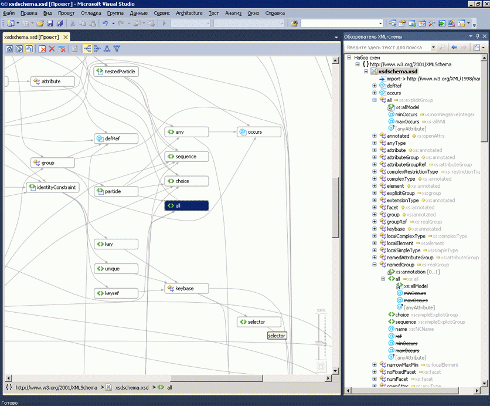
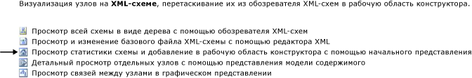

# Представление графика

Представление графика обеспечивает графическое представление глобальных узлов схемы и связей между узлами. Заметьте, что представление графика не позволяет изменять расположение набора схем в области конструктора. Представление графика также содержит панель инструментов конструктора XML-схем и строка навигатора.

 На приведенном ниже рисунке показано представление графика с шестью глобальными узлами в области конструктора:

 

## Область конструктора

 Область конструктора представления графика отображает содержимое [рабочей области конструктора схем XML](../xml-tools/xml-schema-designer-workspace.md). Если рабочая область содержит глобальные узлы из набора схем, узлы будут показаны в области конструктора представления графика, а узлы, связанные друг с другом, будут соединены стрелочками.

 Двойное нажатие на узел в представлении графика открывает редактор XML.

 Чтобы удалить выбранные узлы из рабочей области, используйте панель инструментов конструктора XSD или **удалить** ключа.

 Если область конструктора пуста, редактор XML **обозреватель XML-схем**, и отображаются водяного знака. *Водяного знака* приведен список ссылок на все представления конструктора XSD.

 

 Если набор схем содержит ошибки, в конце списка появится следующий текст: «Воспользуйтесь списком ошибок для просмотра и устранения ошибок в наборе».

## Строка навигатора

 Строка навигатора внизу представления графика показывает месторасположение выбранного узла в наборе схем. Если выбрано несколько элементов, строка навигатора будет пустой.

## Контекстное меню

 В следующей таблице приведены параметры, доступные для всех узлов поверхности конструктора представления графика.

|Параметр|Описание|
|------------|-----------------|
|**Показать в обозревателе XML-схем**|Устанавливает фокус на обозревателе схем и выделяет узел набора схем.|
|**Показать в представлении графика**|Переключается в представление графика (отображается серым цветом).|
|**Создание образца XML**|Этот метод предусмотрен только для глобальных элементов. Создает образец XML-файла для глобального элемента.|
|**Очистить рабочую область**|Очищает рабочую область и область конструктора.|
|**Удалить из рабочей области**|Удаляет выбранные узлы из рабочей области и из области конструктора.|
|**Удалите все, кроме выделенных в рабочей области**|Удаляет узлы, не выделенные в рабочей области и в области конструктора.|
|**Экспортировать схему как рисунок**|Сохраняет область конструктора в XPS-файле.|
|**Выбрать все**|Выбирает все узлы в области конструктора.|
|**Просмотр кода**|Открывает в редакторе XML-файл, содержащий выбранный узел. Элемент, который выбран в **обозреватель XML-схем** также будет выделен в редакторе XML.|
|**Окно "Свойства"**|Открывает **свойства** окна (если он еще не открыт). В данном окне будут выведены сведения об узле.|

 Помимо описанных выше общих параметров контекстное меню для глобальных элементов также имеет следующие параметры:

|Параметр|Описание|
|------------|-----------------|
|**Добавление определения типа**|Добавляет базовый тип в схему.|
|**Добавить все ссылки**|Добавляет все узлы, связанные с элементом, и рисует стрелочки, обозначающие связи между ними.|
|**Добавление членов группы подстановки**|Добавляет все члены группы подстановки. Данный параметр появляется в представлении, если элемент является головным элементом или членом группы подстановки.|
|**Создание образца XML**|Создает образец XML-файла для глобального элемента.|

 Помимо описанных выше общих параметров контекстное меню для глобальных простых и глобальных сложных типов также имеет следующие параметры:

|Параметр|Описание|
|------------|-----------------|
|**Добавить базовый тип**|Если выбранный тип является производным от глобального типа, добавляет базовый тип выбранного типа.|
|**Добавить все ссылки**|Добавляет все ссылки выбранного типа. Это относится ко всем элементам и атрибутам выбранного типа и типов, производных от выбранного.|
|**Добавить все производные типы**|Добавляет все типы, прямо или косвенно являющиеся производными от выбранного типа.|
|**Добавить всех предков**|Добавляет все родительские (базовые) типы.|

 Помимо общих параметров, описанных выше, контекстное меню для глобальных групп и групп атрибутов также имеет следующие параметры:

|Параметр|Описание|
|------------|-----------------|
|**Добавить все ссылки**|Добавляет все узлы, связанные с группой, и рисует стрелочки, обозначающие связи между ними.|
|**Добавляет всех членов**|Добавляет все члены группы и рисует стрелочки, обозначающие связи между ними.|

 Помимо описанных выше общих параметров контекстное меню для глобальных атрибутов также имеет следующие параметры:

|Параметр|Описание|
|------------|-----------------|
|**Добавить все ссылки**|Добавляет все узлы, связанные с группой, и рисует стрелочки, обозначающие связи между ними.|

## Окно \"Свойства\"

 Использование контекстного меню, чтобы открыть **свойства** окна. По умолчанию **свойства** отображается в правом нижнем углу Visual Studio. При нажатии на узел, который отображается в представлении модели содержимого, свойства данного узла будут отображаться в **свойства** окна.

## Панель инструментов XSD

 Следующие кнопки панели инструментов XSD включены, если активно представление графика.

 

|Параметр|Описание|
|------------|-----------------|
|**Показать начальное представление**|Переключается в [, откройте представление](../xml-tools/start-view.md). Это представление может осуществляться с помощью сочетания клавиш: **Ctrl**+**1**.|
|**Показать представление модели содержимого**|Переключается в [представление модели содержимого](../xml-tools/content-model-view.md). Это представление может осуществляться с помощью сочетания клавиш: **Ctrl**+**2**.|
|**Показать представление графика**|Переключается в [графическое представление](../xml-tools/graph-view.md). Это представление может осуществляться с помощью сочетания клавиш: **Ctrl**+**3**.|
|**Очистить рабочую область**|Очищает рабочую область и область конструктора.|
|**Удалить из рабочей области**|Удаляет выбранные узлы из рабочей области и из области конструктора.|
|**Удалите все, кроме выделенных в рабочей области**|Удаляет узлы, не выделенные в рабочей области и в области конструктора. Данный параметр включен в представлении модели содержимого и в представлении графика.|
|**Слева направо**|Изменяет макет в представлении графика на иерархическое представление узлов слева направо. Этот параметр может осуществляться с помощью сочетания клавиш: **Alt**+**со стрелкой вправо**.|
|**Справа налево**|Изменяет макет в представлении графика на иерархическое представление узлов справа налево. Этот параметр может осуществляться с помощью сочетания клавиш: **Alt**+**стрелка влево**.|
|**Сверху вниз**|Изменяет макет в представлении графика на иерархическое представление узлов сверху вниз. Этот параметр может осуществляться с помощью сочетания клавиш: **Alt**+**стрелка вниз**.|
|**Снизу вверх**|Изменяет макет в представлении графика на иерархическое представление узлов снизу вверх. Этот параметр может осуществляться с помощью сочетания клавиш: **Alt**+**стрелка вверх**.|

## Панорамирование/Прокрутка

 Панорамный обзор рабочей области конструктора с помощью полосы прокрутки или удерживая **Ctrl** ключа щелкните и перетащите указатель мыши. При панорамировании области конструктора с использованием перетаскивания, курсор изменяет свой внешний вид на четыре перекрестные стрелочки, указывающие в четырех направлениях.

## Отменить/Повторить

 Функция отменить/повторить включена в представлении графика для следующих действий:

-   Добавление одного узла посредством перетаскивания.

-   Добавление нескольких узлов из окна результатов поиска в обозревателе схемы или запросов начального представления.

-   Удаление одного или нескольких узлов.

## Масштаб

 Масштабирование доступно в нижнем правом углу представления графика.

 Масштабированием можно управлять следующими способами:

-   Удерживая **Ctrl** wheel ключ и прокручивая мыши при наведении указателя мыши на поверхность представления графика.

-   Используя ползунковый элемент управления. Ползунок отображает текущий масштаб.

Ползунок масштаба является непрозрачным, если выбрать его, наведите на него или используйте **Ctrl** колесиком мыши для увеличения масштаба; в других случаях он является прозрачным.

## Интеграция редактора XML

 Можно переключаться между представлением графика и редактором XML, нажимая на узел и используя контекстное меню «Перейти к коду».

 Если изменить набор схем в редакторе XML, изменения будут синхронизированы в представлении графика. Дополнительные сведения см. в разделе [интегрирован с редактором XML](../xml-tools/integration-with-xml-editor.md).

## См. также

- [Область конструктора](../xml-tools/xml-schema-designer-workspace.md)