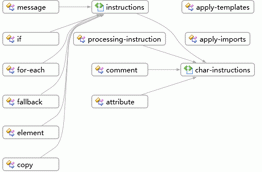

# Как получить общие сведения о наборе схем с использованием представления графика
[!INCLUDE[vs2017banner](../code-quality/includes/vs2017banner.md)]

Данный раздел описывает использование [представления графика](../xml-tools/graph-view.md) для просмотра общего представления узлов в наборе схем и связей между узлами.  
  
### Создание нового XSD\-файла и отображение корневого элемента в представлении модели содержимого  
  
1.  Создайте новый файл XML\-схемы и сохраните файл под именем Relationships.xsd.  
  
2.  Щелкните ссылку **Использование редактора XML для просмотра и изменения базового файла XML\-схемы** в начальном представлении.  
  
3.  Скопируйте образец кода XML\-схемы из источника [Образец XML\-схемы: Связи](../Topic/Sample%20XSD%20File:%20Relationships.md) и вставьте его вместо кода, добавленного в новый XSD\-файл по умолчанию.  
  
4.  Щелкните правой кнопкой мыши в любом месте редактора XML и выберите пункт **Конструктор представлений**.  
  
5.  Выберите представление графика на панели инструментов XSD.  
  
6.  Выберите узел **Набор схем** в обозревателе XML\-схем и перетащите узел в область конструктора в представлении графика.Необходимо увидеть все глобальные узлы и стрелочки, соединяющие связанные друг с другом узлы.  
  
       
  
7.  Щелкните любой узел в области конструктора, и строка навигатора отобразит расположение выбранного узла в наборе схем.  
  
8.  Щелкните правой кнопкой мыши по любому узлу элемента в области конструктора и выберите **Создание образца XML**, чтобы просмотреть документ экземпляра XML.