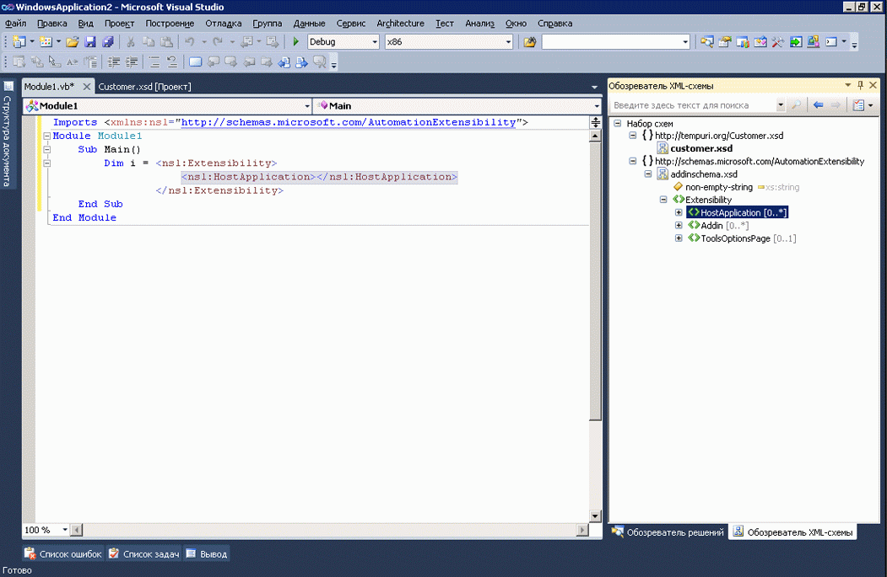

# Интеграция XML-литералов с обозревателем XML-схем

Visual Basic поддерживает XML-литералы, что означает возможность включать XML-фрагменты непосредственно в код Visual Basic. Дополнительные сведения содержатся в разделе [Общие сведения об XML-литералах](/dotnet/visual-basic/programming-guide/language-features/xml/xml-literals-overview).

## Практическое руководство

Если XSD-файл в проекте Visual Basic содержит XML-литерал, то набор XML-схем можно просматривать в **обозревателе XML-схем**. Для просмотра набора схем, связанного с XML-литералом, щелкните правой кнопкой мыши узел XML в XML-литерале или импорте пространства имен XML, и выберите команду **Показать в обозревателе схем**.

Это действие откроет **обозреватель XML-схем** параллельно файлу Visual Basic.

## См. также

- [Практическое руководство. Использование конструктора схем XML с литералами XML](../xml-tools/how-to-use-the-xml-schema-designer-with-xml-literals.md)
