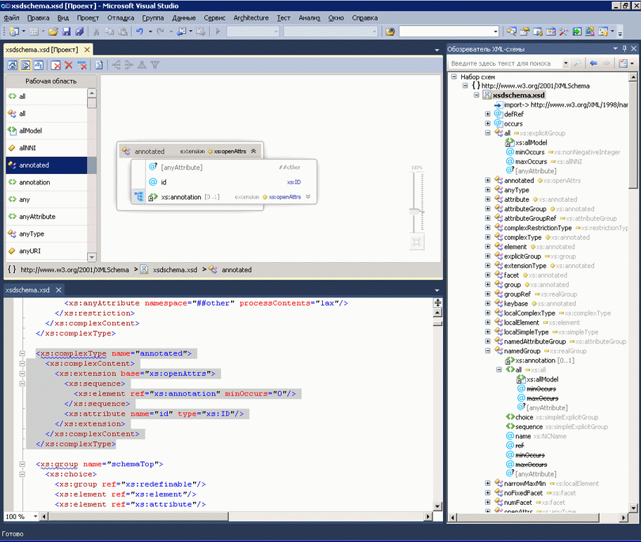

# Интеграция с редактором XML

Конструктор схем XML интегрирован с редактором XML. Если изменить файл XSD в редакторе XML, это изменение будет отражено в [обозревателе схем XML](../xml-tools/xml-schema-explorer.md). Если открыто [представление графика](../xml-tools/graph-view.md) или [представление модели содержимого](../xml-tools/content-model-view.md), изменения будут отражены и в них. Можно перемещаться между конструктором схем XML и редактором XML, используя любой из следующих методов.

- В редакторе XML щелкните правой кнопкой мыши узел и выберите **Показать в обозревателе схем XML**.

- В представлении графиков и **обозревателе схем XML** щелкните правой кнопкой мыши или дважды щелкните узел и выберите **Просмотреть код**. В представлении модели содержимого щелкните узел правой кнопкой мыши и выберите **Просмотреть код**.

На следующем снимке экрана показана схема XML, открытая в **обозревателе схем XML**. **Обозреватель схем XML** отображает набор схем в виде дерева. Редактор XML отображает текстовое представление узла, который сейчас активен в **обозревателе схем XML**.

В некоторых случаях рекомендуется просматривать код в редакторе XML и графическом конструкторе параллельно. Чтобы просмотреть оба файла одновременно, щелкните правой кнопкой мыши в редакторе XML и выберите **Конструктор представлений**. В меню Visual Studio Windows выберите **Создать группу горизонтальных (или вертикальных) вкладок**.

## См. также

- [Обозреватель схемы XML](../xml-tools/xml-schema-explorer.md)
