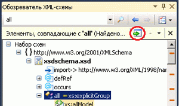

# Поиск набора схем

**Обозреватель схем XML** позволяет искать набор схем следующим образом.

- Поиск по ключевому слову.

- Поиск определенной схемы.

## Поиск по ключевому слову

Поиск по ключевому слову осуществляется посредством ввода подстроки (substring) в текстовом поле **Поиск набора схем** панели инструментов **обозревателя схем XML**.

**Обозреватель схем XML** выполнит поиск набора схем по следующим атрибутам:

- Атрибутам `name` или `ref`, удовлетворяющим указанному ключевому слову. Это позволяет находить элементы, атрибуты, типы и т. д. по имени.

- Атрибуты `schemaLocation` инструкций включения.

- Атрибуты `namespace` инструкций импорта.

## Поиск определенной схемы

**Обозреватель схем XML** также включает встроенные запросы поиска, к которым можно получить доступ с помощью контекстного меню **обозревателя схем XML**. Дополнительные сведения о доступных контекстных меню см. [здесь](../xml-tools/context-menus-xml-schema-explorer.md). Поиск определенной схемы можно также выполнить из начального представления; дополнительные сведения см. в разделе "Сведения о наборе схем" статьи о [начальном представлении](../xml-tools/start-view.md).

## Отображение результатов поиска и навигация по ним

Как только поиск завершен, к панели инструментов добавляется панель сводных результатов, содержащая результаты поиска. Результаты поиска также выделяются в **обозревателе схем XML** и отмечаются делениями на вертикальной полосе прокрутки. Перемещаться по результатам поиска можно, используя кнопки **Перейти к следующему результату поиска** и **Перейти к предыдущему результату поиска** на панели сводных результатов на панели инструментов **обозревателя схем XML**, клавиши **F3** и **SHIFT**+**F3** или щелкая деления на полосе прокрутки.

Добавить результаты поиска в рабочую область можно нажатием кнопки **Добавить выделенные узлы в рабочую область** на панели сводных результатов.

## Очистка результатов поиска

Чтобы очистить результаты поиска, нажмите кнопку **x** на панели сводных результатов на панели инструментов **обозревателя схем XML**.

## См. также

- [Обозреватель схемы XML](../xml-tools/xml-schema-explorer.md)
