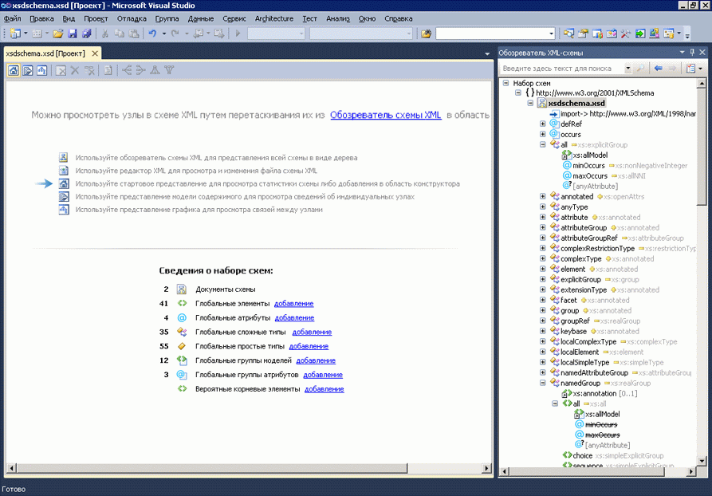

# Начальное представление
[!INCLUDE[vs2017banner](../code-quality/includes/vs2017banner.md)]

Начальное представление является точкой запуска конструктора XML\-схем \(XSD\).При создании нового XSD файла перед вами откроется начальное представление.  
  
 Начальное представление имеет два основных раздела: *водяной знак* и область **Сведения о наборе схем**.Оно также содержит панель инструментов, доступную во всех представлениях конструктора XSD.  
  
   
  
## Водяной знак  
 Область водяного знака содержит список ссылок на все представления конструктора XSD, редактор XML и обозреватель XML\-схем.Если набор схем содержит ошибки, в конце списка появится следующий текст: «Воспользуйтесь списком ошибок для просмотра и устранения ошибок в наборе».  
  
## Сведения о наборе схем  
 Область **Сведения о наборе схем** содержит список типов глобальных узлов схемы и отображает количество экземпляров каждого типа в схеме.Для добавления новых узлов в рабочую область можно использовать ссылки **Добавить**, расположенные рядом с типами узлов.  
  
## Панель инструментов  
 Можно перемещаться между начальным представлением, [представлением модели содержимого](../xml-tools/content-model-view.md) и [представлением графика](../xml-tools/graph-view.md) на панели инструментов конструктора XML\-схем.  
  
   
  
 Следующие кнопки панели инструментов конструктора XSD включены, если активно начальное представление.  
  
|Параметр|Описание|  
|--------------|--------------|  
|**Показать начальное представление**|Переключается в начальное представление.Доступ к данному представлению можно получить с использованием сочетания клавиш: **CTRL \+ 1**.|  
|**Показать представление модели содержимого**|Переключается на представление модели содержимого.Доступ к данному представлению можно получить с использованием сочетания клавиш: **CTRL \+ 2**.|  
|**Показать представление графика**|Переключается в представление графика.Доступ к данному представлению можно получить с использованием сочетания клавиш: **CTRL \+ 3**.|  
  
## См. также  
 [Обозреватель XML\-схем](../xml-tools/xml-schema-explorer.md)   
 [Представление графа](../xml-tools/graph-view.md)   
 [Представление модели содержимого](../xml-tools/content-model-view.md)   
 [XML\-редактор](../xml-tools/xml-editor.md)