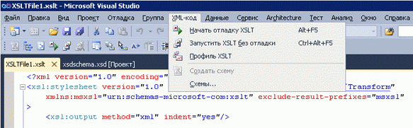

# Профилировщик XSLT
[!INCLUDE[vs2017banner](../code-quality/includes/vs2017banner.md)]

Профилировщик XSLT представляет собой средство профилирования для анализа производительности, используемое при разработке и отладке XSLT\-документов.С помощью профилировщика XSLT разработчики могут измерять и оценивать связанные с производительностью проблемы в XSLT\-коде, создавая подробные отчеты о производительности XSLT.Профилировщик XSLT содержит полезные подсказки по оптимизации таблиц стилей XSL и XSLT, необходимые для приложений XSLT, требующих максимальной производительности.  
  
 Профилировщик XSLT является частью Visual Studio 2010. Доступ к нему осуществляется через меню **XML** в Visual Studio.  
  
   
  
 Профилировщик XSLT впервые был представлен в виде надстройки для Visual Studio 2008.Дополнительные сведения см. в разделе «Дополнительные ресурсы» на странице [XSLT Profiler for Visual Studio Feb 08 Community Technology Preview](http://go.microsoft.com/fwlink/?LinkId=142987).  
  
> [!NOTE]
>  Внешний вид некоторых окон в Visual Studio 2010 может отличаться от изображенного в этих документах, так как некоторые визуальные элементы были изменены по сравнению с версией Visual Studio 2008.  
  
## См. также  
 [Пошаговое руководство. Профилировщик XSLT](../xml-tools/walkthrough-xslt-profiler.md)