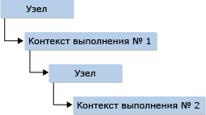

# <a name="hosting-the-javascript-runtime"></a>Размещение среды выполнения JavaScript
API среды выполнения JavaScript (JsRT) предоставляют настольным приложениям, приложениям Магазина Windows и серверным приложениям, выполняемым в ОС Windows, способ добавления возможностей создания сценариев в приложение с использованием стандартизированного ядра JavaScript Chakra, которое также используется Microsoft Edge и Internet Explorer. Эти API доступны в Windows 10 и любой версии ОС Windows, если на компьютере установлен Internet Explorer версии 11.0. Дополнительные сведения см. в разделе [Reference (JavaScript Runtime)](../chakra-hosting/reference-javascript-runtime.md). Сведения об использовании JsRT в приложениях для Магазина Windows см. в разделе [JsRT and the Universal Windows Platform](#Windows).  
  
> [!NOTE]
>  Настоящая документация предназначена для специалистов, которые в общих чертах знакомы с языком JavaScript.  
  
## <a name="concepts"></a>Основные понятия  
 Размещение модуля JavaScript c использованием API JsRT осуществляется на основе двух ключевых принципов: среды выполнения и контексты выполнения.  
  
 *Среда выполнения* представляет собой полную среду выполнения JavaScript. Каждая создаваемая среда выполнения имеет собственную изолированную кучу, в которой выполняется сборка мусора, и собственный поток JIT-компилятора и поток сборщика мусора по умолчанию. *Контекст выполнения* представляет собой среду JavaScript, имеющую собственный глобальный объект JavaScript, отличающийся от всех остальных контекстов выполнения. Одна среда выполнения может содержать несколько контекстов выполнения, в таких случаях все контексты выполнения используют JIT-компилятор и поток GC, связанный со средой выполнения.  
  
 Среда выполнения представляет единый поток выполнения. В определенном потоке в определенное время может быть активна только одна среда выполнения, и среда выполнения в определенный момент может быть активна только в одном потоке. Среды выполнения используют прокатное разделение потоков, то есть неактивная на текущий момент в потоке среда (которая не выполняет никакой код JavaScript и не занята ответом на какие-либо вызовы узла) может использоваться в любом другом потоке, в котором нет активной среды выполнения.  
  
 Контексты выполнения связаны с определенной средой выполнения и выполняют код в этой среде выполнения. В отличие от сред выполнения, в потоке может существовать несколько одновременно активных потоков. Хост может вызвать контекст выполнения, чтобы контекст выполнения вызвал хост, а также хост может вызвать другой контекст выполнения.  
  
   
  
 На практике можно использовать один контекст выполнения, если только хосту не нужно выполнять код в раздельных средах. Аналогично, одной среды выполнения достаточно в большинстве случаев, если только хосту не нужно параллельно выполнить несколько элементов кода.  
  
## <a name="memory-management"></a>Управление памятью  
 JavaScript — это язык с поддержкой сборки мусора, поэтому при работе с API JsRT из другого языка нужно не забывать об определенных аспектах.  
  
 Главное, помнить о том, что сборщик мусора JavaScript распознает ссылки на значения всего в двух местоположениях: куче своей среды выполнения и стеке. Следовательно, ссылка на значение JavaScript, хранимое внутри другого значения JavaScript или локальной переменной в стеке, будет всегда видно сборщику мусора. Однако ссылки, хранимых в других местах, например в кучах, управляемых хостом или системой, не будут распознаваться сборщиком мусора, что может привести к преждевременному сбору значений, которые до сих пор используются хостом.  
  
> [!IMPORTANT]
>  Некоторые компиляторы языка (например, компилятор Visual Studio C++) по возможности оптимизируют локальные переменные. Необходимо убедиться, что локальные переменные, которые ссылаются на значения JavaScript, включены в стек, если они должны поддерживать эти значения в активном состоянии.  
  
 Если ссылка на значение JavaScript будет храниться в расположении, которое не видно сборщику мусора, хост должен добавлять и удалять ссылки вручную, используя API JsRT.  
  
## <a name="exception-handling"></a>Обработка исключений  
 При возникновении исключения JavaScript во время выполнения скрипта содержащая его среда выполнения переводится в состояние исключения. В состоянии исключения код не выполняется и все вызовы API завершаются ошибкой с кодом `JsErrorInExceptionState` до тех пор, пока хост не извлечет и не удалит исключение с помощью API `JsGetAndClearException` . Если хост возвращается из обратного вызова JavaScript, не выведя среду выполнения из состояния исключения, исключение JavaScript будет создано повторно, как только контроль будет снова передан обработчику JavaScript. Это позволяет обратным вызовам узла создавать исключение JavaScript, переводя среду выполнения в состояние исключения и затем возвращаясь из обратного вызова узла.  
  
 Хосту не разрешено позволять собственным внутренним исключениям распространяться по обратным вызовам хоста: любые методы обратного вызова должны перехватить все исключения хоста, прежде чем контроль будет снова передан среде выполнения.  
  
## <a name="runtime-resource-usage"></a>Использование ресурсов среды выполнения  
 API JsRT предоставляют способ мониторинга и изменения способа использования ресурсов средами выполнения. Как правило, использование ресурсов подразделяется на несколько категорий.  
  
-   **Использование потока**. По умолчанию каждая среда выполнения создает выделенный поток JIT-компилятора и выделенный поток GC для обслуживания среды выполнения. При создании среды выполнения с флагом `JsRuntimeAttributeDisableBackgroundWork` работа JIT и GC выполняется в самом потоке среды выполнения, а не в отдельных фоновых потоках для каждого из этих объектов. Хост также может предоставить обратный вызов службы потока вызову `JsCreateRuntime` , что позволит хосту спланировать работу JIT и GC любым удобным для него образом.  
  
-   **Использование памяти**. Существует несколько способов отслеживания и изменения использования памяти среды выполнения. Если среда выполнения функционирует в течение долгого времени, хост может задать флаг `JsRuntimeAttributeEnableIdleProcessing` при создании среды выполнения, а затем вызвать `JsIdle` , когда хост будет находиться в состоянии простоя. Это позволяет обработчику отсрочить некоторые операции по очистке памяти и учету до времени простоя.  
  
     Хост может отслеживать сборку мусора, вызывая метод `JsSetRuntimeBeforeCollectCallback`. Кроме того, хост может осуществлять мониторинг выделяемых кучей ресурсов, вызывая метод `JsSetRuntimeMemoryAllocationCallback`. Обратите внимание, что этот API не выполняет обратный вызов при каждом выделении ресурсов JavaScript, а только когда куче среды выполнения требуется больше пространства, из которого будут выделены ресурсы. Обратный вызов выделения памяти может отклонить запрос, что запустит сбор мусора и создаст ошибку «Недостаточно памяти» в среде выполнения, если памяти недостаточно.  
  
     Этот хост также может вызывать `JsSetRuntimeMemoryLimit` , чтобы установить лимит на использование памяти средой выполнения. Достигнув этого лимита, среда выполнения инициирует сбор мусора и выдаст ошибку «Недостаточно памяти», если памяти недостаточно.  
  
-   **Прерывание и оценка сценариев**. Хост может вызывать метод `JsDisableRuntimeExecution` , чтобы завершить выполнение в среде выполнения. Этот вызов может быть выполнен в любое время и из любого потока. Поскольку завершение сценария зависит от достижения вставленных в код точек условия, сценарий, возможно, не завершится в тот же момент, но это будет сделано очень скоро после достижения такой точки. По умолчанию точки условия завершения помещаются в созданном коде достаточно экономно и не всегда охватывают все ситуации, например бесконечный цикл. Создание среды выполнения с флагом `JsRuntimeAttributeAllowScriptInterrupt` заставляет среду выполнения вставлять дополнительные проверки для бесконечных циклов, зачастую за счет незначительного снижения производительности.  
  
     Если хосту требуется запретить создание собственного кода JIT-компилятором, можно задать флаг `JsRuntimeAttributeDisableNativeCodeGeneration` . Хост также может запретить скриптам динамическое выполнение скриптов, задав флаг `JsRuntimeAttributeDisableEval` .  
  
## <a name="debugging-and-profiling"></a>Отладка и профилирование  
 API JsRT поддерживают отладку и профилирование, используя технологию активных сценариев.  
  
 Начиная с версии Windows 10, модуль Chakra JavaScript поддерживает прежние версии модуля и модуль Edge, поэтому в JsRT можно работать и с тем, и с другим (см. подробные сведения в статье [Работа с модулем Edge и модулями предыдущих версий](../chakra-hosting/targeting-edge-vs-legacy-engines-in-jsrt-apis.md)). Отладка скриптов в Visual Studio по-разному работает в предыдущей версии модуля и в модуле Edge. В предыдущем модуле узлу необходимо было предоставить указатель [интерфейс IDebugApplication](../winscript/reference/idebugapplication-interface.md), который можно получить из экземпляра [интерфейс IProcessDebugManager](../winscript/reference/iprocessdebugmanager-interface.md). В модуле Edge `IDebugApplication` упразднено, и модуль Chakra реализует возможности отладки машинного кода и скрипта, используя отладчик Visual Studio b не требуя от пользователя внедрения `IDebugApplication` .  
  
 Чтобы сделать скрипты в контексте выполнения доступными для отладки, модуль Chakra должен переключиться на использование менее эффективных методов выполнения кода. Сам по себе доступный для отладки код выполняется медленнее, чем недоступный. В результате с модулем предыдущих версий хост может начать отладку в контексте выполнения с самого начала, заранее предоставив указатель `IDebugApplication` в контексте `JsCreateContext`, или подождать, пока не потребуется отладка, а затем вызвать метод `JsStartDebugging`. С модулем Edge `JsCreateContext` более не принимает параметр `IDebugApplication` , поэтому скрипт доступен для отладки только после вызова `JsStartDebugging` . При отладке с помощью Visual Studio необходимо включить параметр отладчика "Скрипт".  
  
 Существуют два способа профилирования кода JavaScript в контексте выполнения. Профилировщик командной строки Visual Studio (vsperf.exe) можно использовать в Windows 8.1 и более поздних версиях с переключателем /js, чтобы создать отчет по коду JavaScript, выполняемому в приложении. Кроме того, хост может вызвать `JsStartProfiling` и `JsStopProfiling` напрямую и предоставить обратному вызову возможность выполнить профилирование самостоятельно. Хост также может изучить состояние кучи, в которой был собран мусор, вызвав `JsEnumerateHeap`. Профилирование в JsRT работает одинаково при использовании модуля предыдущих версий и модуля Edge. Тем не менее, API профилирования JsRT (`JsStartProfiling`, `JsStopProfiling`, `JsEnumerateHeap`и `JsIsEnumeratingHeap`) недоступны для универсальных приложений Windows.  
  
<a name="Windows"></a>   
## <a name="jsrt-and-the-universal-windows-platform"></a>JsRT and the Universal Windows Platform  
 Можно воспользоваться API JsRT для добавления в универсальное приложение Windows возможностей составления сценариев. Универсальное приложение Windows, использующее API JsRT, должно будет использовать API Edge JSRT, которые, в свою очередь, используют модуль Edge Chakra. Дополнительную информацию см. в разделе [Работа с модулем Edge и модулями предыдущих версий](../chakra-hosting/targeting-edge-vs-legacy-engines-in-jsrt-apis.md). Полный набор API JsRT доступен для универсальных приложений Windows за исключением поддержки профилирования и перечисления куч (`JsStartProfiling`, `JsStopProfiling`, `JsEnumerateHeap`и `JsIsEnumeratingHeap` не поддерживаются).  
  
 JsRT также позволяет скриптам осуществлять доступ к любым [API универсальной платформы Windows (UWP)](https://msdn.microsoft.com/en-us/library/windows/apps/br211377.aspx) в собственном коде, предоставив пространство имен API через API Edge JsRT `JsProjectWinRTNamespace`. Несмотря на то что универсальные приложения Windows не требуют никакой дополнительной настройки помимо проецирования необходимых пространств имен, в классическом приложении Windows (Win32) необходимо реализовать механизм инициализируемого COM делегированного переноса через `JsSetProjectionEnqueueCallback` , чтобы включить события и асинхронные API. В следующем примере приложения Win32 используются асинхронные API UWP для создания HTTP-клиента, позволяющего получать содержимое от Uri:  
  
```cpp  
typedef struct _jsCall {  
    JsProjectionCallback jsCallback;  
    JsProjectionCallbackContext jsContext;  
    HANDLE event;  
} jsCall;  
  
// Set up delegated pumping mechanism; not necessary in UWP applications.  
jsCall outstandingCall = {};  
CoInitializeEx(nullptr, COINIT_MULTITHREADED);  
JsSetProjectionEnqueueCallback([](JsProjectionCallback jsCallback,   
JsProjectionCallbackContext jsContext, void *callbackState) {  
    jsCall* call = (jsCall*)callbackState;  
    call->jsCallback = jsCallback;  
    call->jsContext = jsContext;  
    SetEvent(call->event);  
    },  
&outstandingCall);  
HANDLE event = CreateEventEx(NULL, NULL, CREATE_EVENT_MANUAL_RESET, EVENT_ALL_ACCESS);  
outstandingCall.event = event;  
  
// Project necessary namespaces.  
JsProjectWinRTNamespace(L"Windows.Foundation");  
JsProjectWinRTNamespace(L"Windows.Web");  
  
// Get content from an Uri.  
JsRunScript(L"var uri = new Windows.Foundation.Uri(\"http://somedatasource.com\"); " \  
    L"var httpClient = new Windows.Web.Http.HttpClient();" \  
    L"httpClient.getStringAsync(uri).done(function (content) { " \  
    L"    // do something with the string content " \    
    L"}, onError); " \  
    L"function onError(reason) { " \  
    L"    // error handling " \        
    L"}",   
    currentSourceContext, L"", &result);  
  
// Wait for async call to come in and then execute; not necessary in UWP applications.  
WaitForSingleObjectEx(outstandingCall.event, 10000, FALSE) == WAIT_OBJECT_0;  
outstandingCall.jsCallback(outstandingCall.jsContext);  
  
```  
  
## <a name="see-also"></a>См. также  
 [Пример приложения среды выполнения JavaScript](http://go.microsoft.com/fwlink/p/?LinkID=306674&clcid=0x409)   
 [Справочник (среда выполнения JavaScript)](../chakra-hosting/reference-javascript-runtime.md)   
 [Размещение среды выполнения JavaScript](../chakra-hosting/javascript-runtime-hosting.md)
